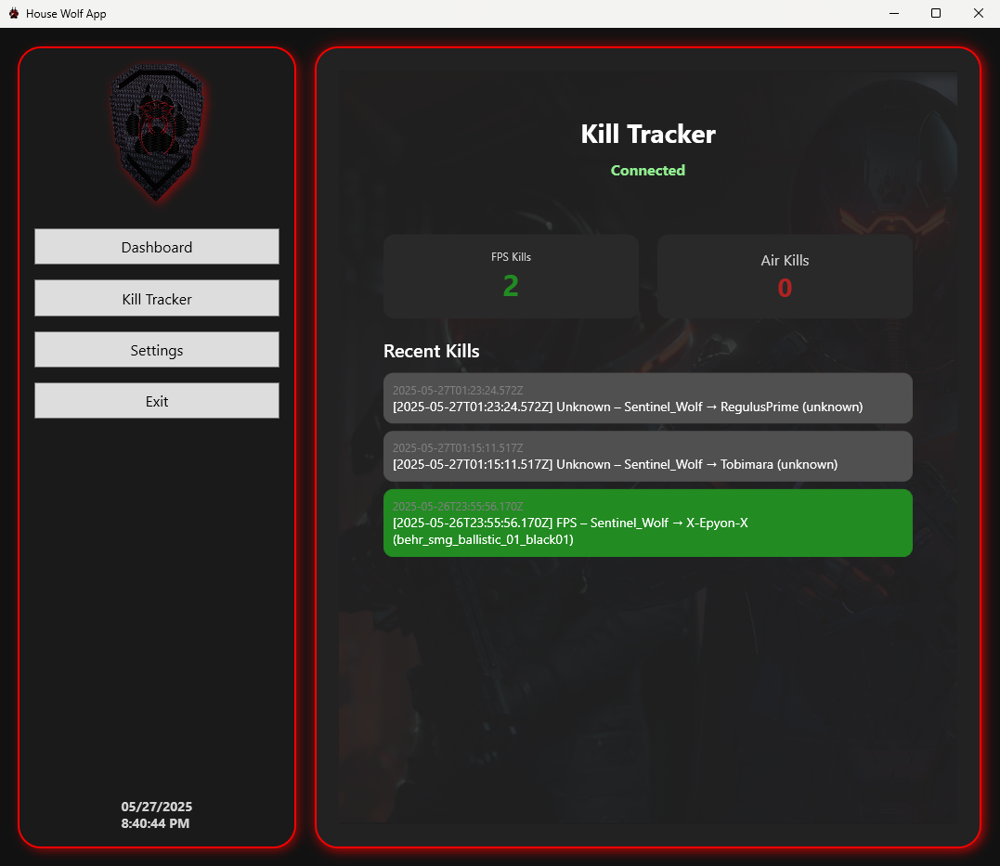

<p style="text-align: center;">
  
</p>

# House Wolf App
**A companion application for Star Citizen** built in .NET with Clean Architecture.

## Table of Contents

- [Features](#-features)
- [Roadmap](#-roadmap)
- [Screenshots](#-screenshots)
- [Installation](#-installation)
- [Configuration](#-configuration)
- [Tags](#-tags)
- [Usage](#-usage)
- [License](#-license)
- [Crafted with ❤️](#crafted-with-)


## ✨ Features

* **Real-time Kill Tracker** 🎯, that parses game logs, categorizes kills (FPS, Air, Vehicle), displays live feeds, stats, and export
  to Sheets/CSV.
* **Trade & Mission Planner** 🗺️ Browse commodities, calculate optimal routes, and save itineraries with ease.
* **Discord & Google Sheets Sync** 🤖 Auto-post updates, award announcements, and sync data bi-directionally.
* **Modular Architecture** 🧩 Clean Architecture layers for presentation, application, domain, and infrastructure.
* **Theming & UI** 🎨 Dark/minimal themes with custom division accents and glowing section highlights.
* **RBAC & Error Handling** 🔐 Role-based access, retry/backoff, and circuit breakers for robust operation.


## 🗺️ Roadmap

| Module                            | Status      | Key Components                                        |
|-----------------------------------|-------------|-------------------------------------------------------|
| Real-Time Kill Tracker (🎯)       | In Progress | `KillLogMonitor`, `KillParser`, `KillTrackerView`     |
| Trade & Hauling Companion (📦)    | Planned     | `RouteCalculator`, `PriceService`                     |
| Org Operations & Scheduling (📅)  | Planned     | `OperationService`, `DiscordBotService`               |
| Mission & Contract Board (📜)     | Backlog     | `MissionBoardView`, `AssignmentService`               |
| Dynamic UEE Map Viewer (🗺️)      | Backlog     | `MapControl`, `OverlayService`                        |
| Loadout & Inventory Tracker (🎒)  | Backlog     | `InventoryService`, `LoadoutManager`                  |
| Operation Management System (⚔️)  | In Progress | Discord slash commands, WinForms operations dashboard |
| Medal Nomination & Approval (🎖️) | In Progress | `MedalService`, `ImageGenerator`, `ApprovalQueue`     |
| Guide Request System (🧭)         | Planned     | `GuideRequestService`, `MatchGuideHandler`            |


## 📸 Screenshots

<p style="text-align: center;">
  
  
</p>


## 🚀 Installation

1. **Clone the repository**:

   ```bash
   git clone https://github.com/YourUsername/HWT.git
   cd HWT
   ```
2. **Restore dependencies & build**:

   ```bash
   dotnet restore
   dotnet build --configuration Release
   ```
3. **Run the application**:

   ```bash
   dotnet run --project src/HWT.Presentation
   ```

## ⚙️ Configuration

1. Copy `appsettings.sample.json` to `appsettings.json`.
2. Set your credentials and IDs:

    * `StarCitizenApi:ApiKey` – Your SC API key.
    * `GoogleSheets:SpreadsheetId` – Target sheet ID.
    * `Discord:BotToken` – Discord bot token.
3. Customize roles and themes in `appsettings.json` as needed.

## 🏷️ Tags

[](https://dotnet.microsoft.com/)
[](https://docs.microsoft.com/dotnet/desktop/wpf/)
[](https://docs.microsoft.com/dotnet/desktop/wpf/)
[](https://github.com/ardalis/CleanArchitecture)
[](https://discord.com)
[](https://www.google.com/sheets/about/)

## 📖 Usage

After launching, navigate through tabs:

* **Live Ops Feed**: View ongoing combat events.
* **Kill History**: Explore past kills with filters.
* **Player Stats**: Analyze performance charts.
* **Settings**: Configure API keys, sheet IDs, themes, and roles.

## 📜 License

This project is licensed under the [MIT License](LICENSE).

## Crafted with ❤️
<p style="text-align: center;">
  Crafted with ❤️ by the House Wolf community.
</p>
